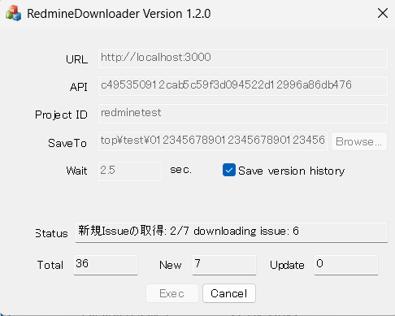

# RedmineDownloader
RedmineDownloader is a GUI tool designed to batch download and back up ticket information, attachments from Redmine.

## Features
* Simple
  Export tickets with straightforward commands and a user-friendly interface.
* Flexible
  Uses a configuration file located in the same folder as the executable. By placing the executable in different project folders, you can easily manage backups for multiple projects.
* History Tracking
  When an issue is updated, the tool can save a copy under a different name while updating the main issue file. This provides strong protection against "blank page attacks" (accidental or malicious data erasure).
* Designed for Automated Daily Tasks
  Supports command-line options to automate downloads and even shut down the software upon completion.
* Interval
  You can set an interval between access to reduce server load, like 0.5 sec.
* Long Path
  The software can handle filenames and paths exceeding 255 characters.
* Prerequisites
  Requires Redmine API access permissions (API Key).
* License
  MIT License

## Command Line Options
* -x
  Automatically starts the download process immediately after the software launches. The software will automatically exit once the download is complete.
